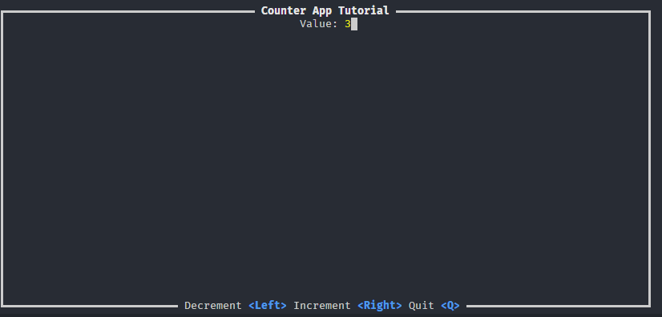

## Ratatui Counter App
A simple CLI counter app created by following the Ratatui tutorial:
https://ratatui.rs/tutorials/counter-app/

I have created this in order to learn more about rust.

### Features

- Handle arrow right and left events.
- Handle key::press events (Q or q) to exit the application
- Implement error hooks to capture errors and restore the terminal to previous/normal state.